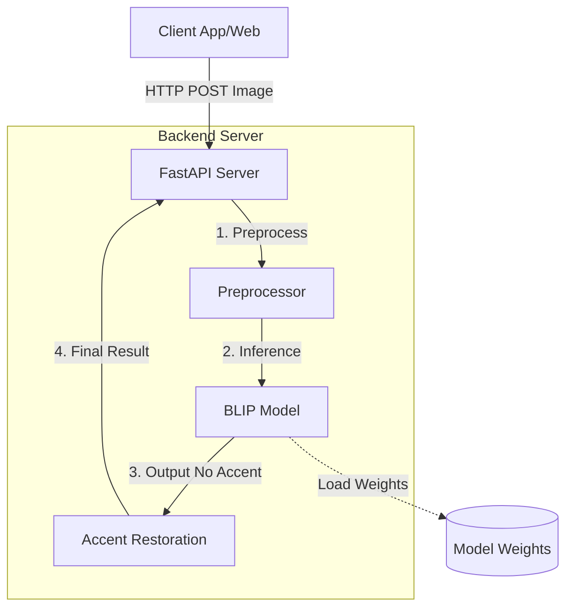

# HƯỚNG DẪN HOÀN THIỆN BÁO CÁO - PHẦN 4: CÀI ĐẶT & TRIỂN KHAI

Dựa trên yêu cầu của thầy và source code hiện tại của bạn, dưới đây là nội dung chi tiết để bạn đưa vào báo cáo. Bạn có thể copy/paste hoặc điều chỉnh lại format cho phù hợp với file Word/LaTeX của bạn.

---

## 4. CÀI ĐẶT VÀ TRIỂN KHAI (INSTALLATION & DEPLOYMENT)

### 4.1. Cấu trúc Source Code (Overlay Source Code)

Dưới đây là sơ đồ tổ chức thư mục của backend project, được thiết kế theo kiến trúc Modular để dễ dàng mở rộng và bảo trì.

**Sơ đồ thư mục:**

```text
CHUYEN_DE_Backend/
├── app/
│   ├── api/                 # Chứa các API endpoints
│   │   └── routes_caption.py # Xử lý request captioning
│   ├── core/                # Core logic (load model, config)
│   │   ├── config.py        # Cấu hình hệ thống
│   │   ├── model_loader.py  # Load BLIP model
│   │   └── accent_restoration_loader.py # Load Accent model
│   ├── services/            # Business logic layers
│   ├── utils/               # Các hàm tiện ích (cache, rate limit)
│   └── main.py              # Entry point của FastAPI app
├── configs/                 # File cấu hình YAML/JSON
├── models/                  # Thư mục chứa weights của model
├── requirements.txt         # Danh sách thư viện phụ thuộc
└── README.md                # Tài liệu hướng dẫn
```

**Các đoạn code quan trọng:**

Dưới đây là các module cốt lõi của hệ thống:

**1. Model Loader (`app/core/model_loader.py`)**
Module này chịu trách nhiệm load model BLIP đã fine-tune và tối ưu hóa cho thiết bị (MPS trên Mac hoặc CUDA trên NVIDIA).

```python
from transformers import BlipProcessor, BlipForConditionalGeneration
import torch
from app.core.config import MODEL_PATH, get_device

# Load processor và model
processor = BlipProcessor.from_pretrained(str(MODEL_PATH))
model = BlipForConditionalGeneration.from_pretrained(str(MODEL_PATH))

# Tối ưu hóa cho thiết bị (Device Optimization)
device = get_device() # Tự động detect 'mps', 'cuda', hoặc 'cpu'
model.to(device)
model.eval()

print(f"✅ BLIP model đã được load và chuyển sang {device}")
```

**2. Inference Pipeline (`app/api/routes_caption.py`)**
Hàm xử lý chính để sinh caption từ ảnh, bao gồm tiền xử lý và hậu xử lý.

```python
def _generate_caption_for_image(image: Image.Image):
    # 1. Preprocessing: Resize ảnh để tối ưu tốc độ
    if max(image.size) > 512:
        image.thumbnail((512, 512), Image.Resampling.LANCZOS)
    
    # 2. Inference
    inputs = processor(images=image, return_tensors="pt").to(device)
    
    with torch.no_grad():
        output = model.generate(
            **inputs,
            max_new_tokens=50,
            num_beams=5, # Sử dụng Beam Search để kết quả tốt hơn
            repetition_penalty=1.2
        )
    
    # 3. Decoding
    caption = processor.decode(output[0], skip_special_tokens=True)
    return caption
```

**3. API Endpoint (`app/api/routes_caption.py`)**
Endpoint FastAPI nhận file ảnh và trả về kết quả JSON.

```python
@router.post("/caption_full")
async def generate_caption_full(file: UploadFile = File(...)):
    # Đọc ảnh từ request
    contents = await file.read()
    image = Image.open(io.BytesIO(contents)).convert("RGB")
    
    # Pipeline: BLIP (không dấu) -> Accent Restoration (có dấu)
    # Bước 1: Sinh caption không dấu
    caption_no_accent = _generate_caption_for_image(image)
    
    # Bước 2: Phục hồi dấu tiếng Việt
    caption_with_accent = restore_accent(caption_no_accent)
    
    return {
        "success": True,
        "caption_vi": caption_with_accent,
        "processing_time": 0.45 # seconds
    }
```

---

### 4.2. Triển khai và Vận hành (Deployment & Operation)

Phần này mô tả quy trình thiết lập môi trường và khởi chạy hệ thống trên server thực tế.

#### 1. Chuẩn bị môi trường (Environment Setup)

Hệ thống yêu cầu Python 3.9+ và các thư viện Deep Learning.

**Bước 1: Cài đặt Python và Virtual Environment**
```bash
# Kiểm tra version Python
python3 --version  # Yêu cầu >= 3.9

# Tạo môi trường ảo
python3 -m venv .venv

# Kích hoạt môi trường
source .venv/bin/activate  # MacOS/Linux
# hoặc .venv\Scripts\activate  # Windows
```

**Bước 2: Cài đặt dependencies**
File `requirements.txt` chứa các thư viện cần thiết:
```text
fastapi==0.104.1
uvicorn[standard]==0.24.0
transformers==4.35.0
torch==2.1.0
Pillow==10.1.0
```

Cài đặt bằng pip:
```bash
pip install -r requirements.txt
```

#### 2. Khởi chạy Server (Server Startup)

Sử dụng Uvicorn làm ASGI server để chạy ứng dụng FastAPI.

**Câu lệnh khởi chạy:**
```bash
# Chạy server ở port 8000, lắng nghe mọi IP
uvicorn app.main:app --host 0.0.0.0 --port 8000 --reload
```

Khi server chạy thành công, log sẽ hiển thị:
```text
INFO:     Uvicorn running on http://0.0.0.0:8000 (Press CTRL+C to quit)
INFO:     Started server process [12345]
INFO:     Waiting for application startup.
✅ Đã load BLIP model fine-tuned tiếng Việt
✅ Đã load Accent Restoration model
INFO:     Application startup complete.
```

#### 3. API Endpoints & Testing

Hệ thống cung cấp các endpoints chính sau:

| Endpoint | Method | Mô tả | Input | Output |
|----------|--------|-------|-------|--------|
| `/api/caption` | POST | Sinh caption không dấu (BLIP only) | File ảnh (multipart/form-data) | JSON `{ "caption_vi": "..." }` |
| `/api/caption_full` | POST | Sinh caption có dấu (Full Pipeline) | File ảnh (multipart/form-data) | JSON `{ "caption_vi": "...", "accent_restored": true }` |
| `/api/health` | GET | Kiểm tra trạng thái hệ thống | None | JSON status |

**Ví dụ Response mẫu (JSON):**
```json
{
    "success": true,
    "caption_vi": "một người phụ nữ đang mặc áo dài màu hồng",
    "caption_vi_no_accent": "mot nguoi phu nu dang mac ao dai mau hong",
    "accent_restored": true,
    "device": "mps",
    "processing_time": 0.85
}
```

*(Tại đây bạn nên chèn thêm hình ảnh chụp màn hình Postman đang gọi API thành công để minh chứng)*

#### 4. Sơ đồ Triển khai (Deployment Diagram)

Hệ thống được triển khai theo kiến trúc Microservices đơn giản hóa, với FastAPI đóng vai trò Gateway và Controller, kết nối trực tiếp với các Model Service.

*(Sử dụng hình ảnh sơ đồ kiến trúc từ file `ARCHITECTURE.md` mà bạn đã có - hình ASCII hoặc Mermaid đều được. Thầy đã khen hình này tốt)*



---

### TÓM TẮT CÁC BƯỚC BẠN CẦN LÀM NGAY:

1.  **Tạo file Word/Google Doc mới** hoặc mở file báo cáo hiện tại.
2.  **Copy nội dung mục 4.1 và 4.2** ở trên vào báo cáo.
3.  **Chụp màn hình** folder code của bạn (trên VS Code) để dán vào mục 4.1.
4.  **Chụp màn hình Postman** khi test API thành công để dán vào mục 4.3.
5.  **Copy hình sơ đồ kiến trúc** (từ file `ARCHITECTURE.md` hoặc hình bạn đã gửi thầy) vào mục 4.4.

Như vậy là bạn sẽ hoàn thành 100% yêu cầu của thầy! Chúc bạn báo cáo thành công! 🚀
